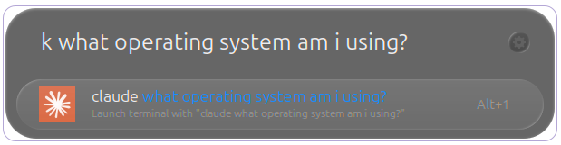

# Claude Code Launcher for Ulauncher

A simple Ulauncher extension to quickly launch Claude Code terminal sessions.

## Features

- Launch Claude Code in your default terminal with a simple keyword
- Pass arguments directly: `k test` runs `claude test`
- Handles arguments with spaces: `k what is my default terminal`
- Automatically detects Claude Code installation path
- Starts Claude in your home directory
- Works with any terminal (gnome-terminal, kitty, alacritty, etc.)

## Screenshot



## Prerequisites

- [Ulauncher](https://ulauncher.io/) installed
- [Claude Code](https://docs.anthropic.com/en/docs/claude-code) installed

**Tested on:** Ubuntu 24.04.2 LTS

Install Claude Code:
```bash
npm install -g @anthropic-ai/claude-code
```

## Installation

1. Clone this repository to your Ulauncher extensions directory:
```bash
git clone https://github.com/1jehuang/Claude-Code-ULauncher-Extension.git ~/.local/share/ulauncher/extensions/com.github.1jehuang.claude-code
```

2. Restart Ulauncher or reload extensions

## Usage

- Open Ulauncher (default: Alt+Space)
- Type `k` to launch Claude Code
- Type `kk` to launch Claude Code with dangerous permissions enabled
- Type `k <your question>` to launch Claude with a specific prompt

Examples:
- `k` - Opens Claude Code in terminal
- `kk` - Opens Claude Code with `--dangerously-skip-permissions` flag
- `k help me debug this function` - Opens Claude with debugging request
- `kk write a python script that reads CSV files` - Opens Claude with specific coding task (dangerous mode)
- `k explain what git rebase does` - Opens Claude with technical question
- `k review my code for security issues` - Opens Claude for code review

## Configuration

The extension uses these keywords by default:
- `k` - Normal Claude Code launch
- `kk` - Claude Code with dangerous permissions

You can change these in Ulauncher preferences.

## How it works

The extension automatically detects your Claude Code installation by checking:
- `~/.npm-global/bin/claude`
- `/usr/local/bin/claude`
- `/usr/bin/claude`
- `~/.local/bin/claude`
- System PATH

It launches your default terminal and starts Claude in your home directory.

## Terminal Configuration

The extension detects terminals in this priority order:
1. ghostty
2. gnome-terminal
3. konsole
4. xfce4-terminal
5. terminator
6. alacritty
7. kitty
8. xterm (fallback)

### Changing Default Terminal

To change which terminal the extension uses:

1. **System-wide default**: Set your preferred terminal as the system default:
   ```bash
   sudo update-alternatives --install /usr/bin/x-terminal-emulator x-terminal-emulator /path/to/your/terminal 60
   sudo update-alternatives --config x-terminal-emulator
   ```

2. **Extension priority**: Modify the `terminals` list in `main.py` to reorder terminal preference.

3. **Common terminal paths**:
   - ghostty: `/snap/ghostty/current/bin/ghostty`
   - alacritty: `/usr/bin/alacritty`
   - kitty: `/usr/bin/kitty`
   - gnome-terminal: `/usr/bin/gnome-terminal`

## License

MIT License